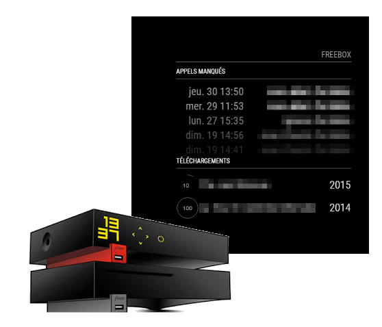
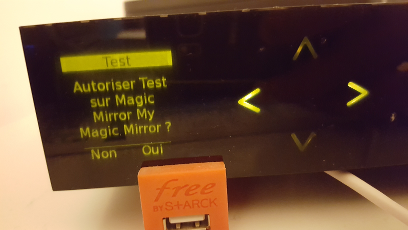

# Module: MMM-FreeBox-Monitor

This module is intended to be used in [MagicMirror²!](https://github.com/MichMich/MagicMirror).

The `MMM-FreeBox-Monitor` displays data from your FreeBox v6 server (Revolution) from the french ISP free. It can combine multiple data

## Using the module

To use this module, add it to the modules array in the `config/config.js` file:
````javascript
modules: [
	{
		module: 'freebox',
		position: 'top_left',	// This can be any of the regions. Best results in left or right regions.
		config: {
			mirrorName: "My Magic Mirror",
			ip: "http://XXX.XXX.XXX.XXX"
			// See 'Configuration options' for more information.
		}
	}
]
````

## Configuration options

The following properties can be configured:


<table width="100%">
	<!-- why, markdown... -->
	<thead>
		<tr>
			<th>Option</th>
			<th width="100%">Description</th>
		</tr>
	<thead>
	<tbody>
		<tr>
			<td><code>ip</code></td>
			<td>The IP address of the FreeBox Server. You can use the internal or external IP address of the FreeBox Server, you can use http://www.myipaddress.com/ service to get it. Default FreeBox Server ip is http://192.168.0.254.<br>
				<br><b>Possible values:</b> any IP address prefixed by http://
			</td>
		</tr>
	
		<tr>
			<td><code>maxCallEntries</code></td>
			<td>The maximum number of missed calls shown.<br>
				<br><b>Possible values:</b> <code>0</code> - <code>100</code>
				<br><b>Default value:</b> <code>3</code>
			</td>
		</tr>
		<tr>
			<td><code>displaySystemData</code></td>
			<td>Display a system data (Temperature/Download Speed).<br>
				<br><b>Possible values:</b> <code>true</code> or <code>false</code>
				<br><b>Default value:</b> <code>true</code>
			</td>
		</tr>
		<tr>
			<td><code>displayMissedCalls</code></td>
			<td>Display missed calls table.<br>
				<br><b>Possible values:</b> <code>true</code> or <code>false</code>
				<br><b>Default value:</b> <code>true</code>
			</td>
		</tr>
		<tr>
			<td><code>displayDownloads</code></td>
			<td>Display downloaded files table.<br>
				<br><b>Possible values:</b> <code>true</code> or <code>false</code>
				<br><b>Default value:</b> <code>true</code>
			</td>
		</tr>
		<tr>
			<td><code>mirrorName</code></td>
			<td>The mirror name used to identify the mirror on Freebox Server. Useful in case of multiple mirrors.<br>
				<br><b>Possible values:</b> <code>string</code>
				<br><b>Default value:</b> <code>My Magic Mirror</code>
			</td>
		</tr>
		<tr>
			<td><code>requestRefresh</code></td>
			<td>The refresh interval in seconds to request refrest on Freebox Server.<br>
				<br><b>Possible values:</b> <code>30</code> - <code>300</code>
				<br><b>Default value:</b> <code>30</code>
			</td>
		</tr>
	</tbody>
</table>

#### FreeBox Monitor registration:

The first time the Magic Mirror starts, a request is sent to Freebox Server to register the application. Select "Oui" on LCD display to register the mirror.



Once session is opened, a file <code>freebox.txt</code> is created at the root of Magic Mirror installation directory. If you change the configuration for <code>mirrorName</code> or <code>ip</code>, you must delete this file.

## Dependencies
- installed via `npm install`

The MIT License (MIT)
=====================

Copyright © 2016 Paul-Vincent Roll

Permission is hereby granted, free of charge, to any person
obtaining a copy of this software and associated documentation
files (the “Software”), to deal in the Software without
restriction, including without limitation the rights to use,
copy, modify, merge, publish, distribute, sublicense, and/or sell
copies of the Software, and to permit persons to whom the
Software is furnished to do so, subject to the following
conditions:

The above copyright notice and this permission notice shall be
included in all copies or substantial portions of the Software.

**The software is provided “as is”, without warranty of any kind, express or implied, including but not limited to the warranties of merchantability, fitness for a particular purpose and noninfringement. In no event shall the authors or copyright holders be liable for any claim, damages or other liability, whether in an action of contract, tort or otherwise, arising from, out of or in connection with the software or the use or other dealings in the software.**
